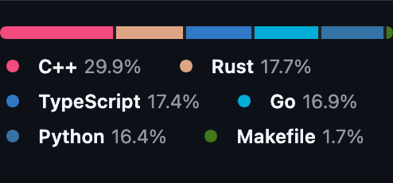

# [Reverse Proxy](https://hieudoanm.github.io/reverse-proxy/)

## Examples

[Vercel](https://reverse-proxy-rho-lime.vercel.app)

## Languages

- [C++](https://cplusplus.com/)
- [Go](https://go.dev/)
- [Node.js](https://nodejs.org/en)
- [Python](https://python.org)
- [Rust](https://www.rust-lang.org/)
  - [Actix](https://actix.rs/)
  - [Hyper](https://hyper.rs/)
  - [Rocket](https://rocket.rs/)
  - [Wrap](https://github.com/seanmonstar/warp)
